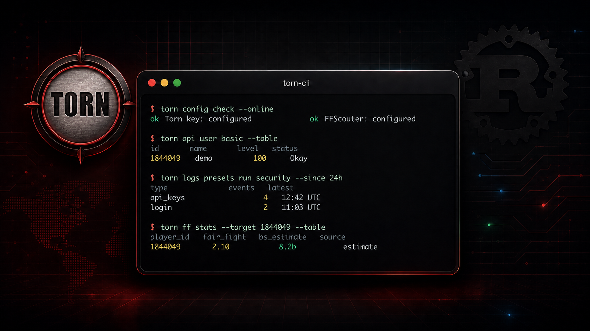
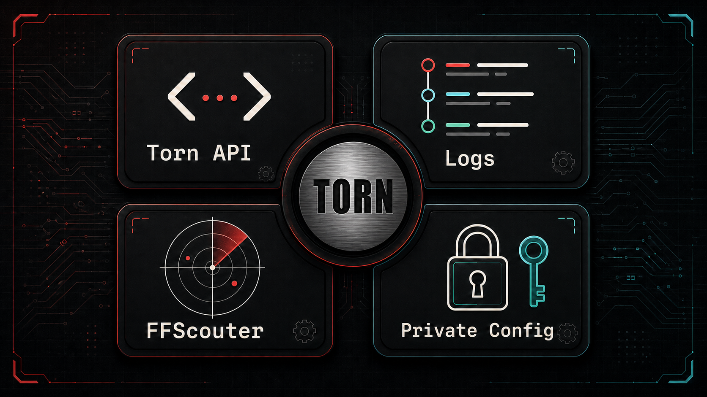

<div align="center">

  # torn-cli

  **A fast, privacy-first Rust CLI/TUI for Torn API v2 + FFScouter.**

  <p>
    <a href="https://github.com/manuelcecchetto/torn-cli/actions/workflows/ci.yml"></a>
    <a href="LICENSE"></a>
    
    
    
  </p>
</div>

<p align="center">
  
</p>

`torn` gives humans and agents ergonomic, scriptable access to Torn API v2 and FFScouter without treating API keys casually. It ships with a bundled endpoint index generated from Torn's OpenAPI spec, so current Torn GET paths work through shortcuts or raw pass-through commands.

<p align="center">
  
</p>

## Why you'll like it

| Capability | What it does |
|---|---|
| 🕵️ Privacy-first auth | Torn keys use `Authorization: ApiKey ...`; FFScouter query keys are redacted from logs, cache keys, URLs, and response bodies. |
| 🧭 Full Torn API v2 reach | Generated endpoint index, raw `api get`, and friendly shortcuts for every bundled Torn group. |
| 🎯 FFScouter toolkit | Stats, stat history, flights/activity, target finder, hit calling, losses marketplace, registration, and announcements. |
| 📊 Logs without spreadsheet pain | Fetch, filter, group, catalog, and preset Torn user-log analysis. |
| 👀 Watch mode | Poll status/profile endpoints with colored `[HH:MM:SS]` prefixes; great for hospital timers. |
| 🤖 Agent-ready | JSON-first outputs, safe defaults, examples, and a project Agent Skill in `.claude/skills/torn-cli/`. |
| 🖥️ TUI setup | Ratatui config shell for entering keys without echoing secret material. |

## Install

From this public repo:

```bash
cargo install --git https://github.com/manuelcecchetto/torn-cli --locked
```

From a local checkout:

```bash
git clone https://github.com/manuelcecchetto/torn-cli.git
cd torn-cli
cargo install --path . --locked
```

Make sure Cargo's bin directory is on your `PATH` after install:

```bash
# macOS/Linux zsh/bash, current shell
export PATH="$HOME/.cargo/bin:$PATH"

# persist for zsh
echo 'export PATH="$HOME/.cargo/bin:$PATH"' >> ~/.zshrc
source ~/.zshrc

# verify
which torn
torn --help
```

You can always run the binary directly as `~/.cargo/bin/torn` if your shell has not reloaded yet.

Windows works too: install Rust with [`rustup-init.exe`](https://rustup.rs/), then run the same `cargo install` commands from PowerShell. If `torn` is not found after install, add `%USERPROFILE%\.cargo\bin` to your user `Path` environment variable and reopen PowerShell.

For development:

```bash
cargo run -- config check
cargo test --all
```

## Quick start

```bash
# Configure keys safely
torn config set torn-api-key
torn config set ffscouter-api-key
# or use the Ratatui setup shell
torn config tui

# Verify config without revealing secrets
torn config check

# Discover endpoints
torn endpoints --service torn
torn endpoints search attacks

# Torn API shortcuts and raw paths
torn api user basic --pretty
torn api user basic --id PLAYER_ID --table
torn api get /user/basic --json
torn api faction members --id FACTION_ID --table
torn api market itemmarket --id ITEM_ID --pretty

# FFScouter
torn ff check-key --pretty
torn ff stats --target PLAYER_ID --pretty
torn ff targets --preset respect --limit 10 --json
```

## Watch a hospital timer

`--watch [interval]` repeats GET requests until interrupted. It bypasses stale cache by default and prefixes every rendered line with a colored local-time marker.

```bash
torn --watch 30s --pretty api user basic --id PLAYER_ID
torn --watch 10s --table api user profile --id PLAYER_ID
```

Example shape:

```text
[22:28:47] id      123456
[22:28:47] name    Example
[22:28:47] level   42
[22:28:47] status  Hospital | until 2026-06-17 23:10:00 UTC
```

## Output modes

```bash
--json              compact JSON for scripts/agents
--pretty            schema-aware human summary; colored on terminals
--raw               raw API body
--table             compact table/key-value output when shape allows
--csv               CSV output when shape allows
--watch [interval]  repeat GET requests until interrupted; default interval 30s
```

Use `--json` for machine parsing and `--pretty` for human summaries. See [`docs/PRETTY_OUTPUT.md`](docs/PRETTY_OUTPUT.md) for the schema-aware pretty-output families.

## Examples

Ready-to-run examples live in [`examples/`](examples/). Bash/macOS/Linux/Git Bash users can run:

```bash
./examples/watch-hospital.sh PLAYER_ID 30s
./examples/faction-members.sh FACTION_ID
./examples/ffscouter-targets.sh respect 10
```

Windows PowerShell users can run:

```powershell
.\examples\watch-hospital.ps1 -PlayerId PLAYER_ID -Interval 30s
.\examples\faction-members.ps1 -FactionId FACTION_ID
.\examples\ffscouter-targets.ps1 -Preset respect -Limit 10
```

Use the uppercase placeholders as values; don't paste angle-bracket placeholders into PowerShell/CMD. If PowerShell execution policy blocks `.ps1` scripts, run the raw `torn ...` command shown above or use `powershell -ExecutionPolicy Bypass -File .\examples\watch-hospital.ps1 -PlayerId PLAYER_ID`. The examples directory also includes an [`agent-brief.md`](examples/agent-brief.md) prompt for AI agents that need to use the CLI safely.

## AI Agent Skill

I checked the current Agent Skills docs before adding this. The open Agent Skills spec defines a skill as a directory containing `SKILL.md`, and Claude Code project skills are discovered under `.claude/skills/<skill-name>/SKILL.md`.

This repo includes:

```text
.claude/skills/torn-cli/SKILL.md
```

Agents that support project skills can use it to learn safe `torn` CLI workflows: never leak keys, prefer `--json` for parsing, bound watch commands in automation, and keep private log requests narrow.

References:

- <https://agentskills.io/specification>
- <https://code.claude.com/docs/en/agent-sdk/skills>

## Safety defaults

- Torn auth uses `Authorization: ApiKey <TORN_API_KEY>`; Torn keys are never put in URLs.
- FFScouter requires `key=` query auth; displayed URLs, verbose logs, cache keys, saved requests, and response bodies redact configured secrets.
- `.env` is ignored by git. Commit `.env.example`, never real keys.
- `torn config set ...` prompts without echo and writes `config.toml` with private permissions on Unix (`0600`, parent dir `0700`).
- `torn config tui` opens a Ratatui key setup shell that never displays existing or newly typed key material.
- `config show` and `config check` report key presence/redacted values only.

## Private key setup

```bash
torn config set torn-api-key        # hidden prompt, saved to private config.toml
torn config set ffscouter-api-key   # hidden prompt
torn config tui                     # Ratatui interactive shell
torn config show                    # redacted only
torn config permissions             # fetch /key/info and summarize access
torn config check --online          # includes the same permission summary
torn config path
```

For automation only, `--stdin` avoids shell history while still requiring care with process pipelines:

```bash
printf '%s' "$TORN_API_KEY" | torn --no-env config set torn-api-key --stdin
```

## Permission preflight

For known Torn API requests, `torn` fetches `/key/info` first and denies locally when the configured key cannot satisfy the requested selection. Predefined keys are treated additively (`Public Only` < `Minimal Access` < `Limited Access` < `Full Access`). Custom keys are matched against exact selections returned by `/key/info`; custom `/user/log` permissions are checked against the requested `--log` or `--cat` filters.

See [`docs/PERMISSIONS.md`](docs/PERMISSIONS.md) for details.

## Torn logs analysis

Full-access Torn keys can fetch `/user/log`. The CLI exposes server-side time/type/category/target filters and client-side grouping/field inventory:

```bash
torn logs fetch --since 24h --to now --limit 100 --pretty
torn logs analyze --since 7d --to now --group-by category --table
torn logs analyze --since 30d --group-by type --contains xanax --data-key item --json
torn logs analyze --since 2026-01-01 --to 2026-01-31 --group-by day --csv
```

Presets cover every observed Torn log category and can be user-defined:

```bash
torn logs presets list
torn logs presets run security --since 30d --group-by type
torn logs presets run money --since 90d --csv
torn logs presets add big-cash --cat 13 --cat 14 --cat 17 --contains money --since 30d --group-by type
```

Catalog commands use Torn's public log metadata endpoints to structure all known log categories/types available to your key:

```bash
torn logs catalog --pretty
torn logs catalog --cat 1 --table
torn logs types --json
torn logs categories --table
```

See [`docs/TORN_LOGS.md`](docs/TORN_LOGS.md) and [`docs/LOG_PRESETS.md`](docs/LOG_PRESETS.md).

## FFScouter

FFScouter is not just battle-stat lookup. `torn ff` wraps stats, stat history, premium flights/activity, target finder, hit calling, losses marketplace seller flows, registration/status, and announcements:

```bash
torn ff stats --target PLAYER_ID,PLAYER_ID
torn ff stats-history --target PLAYER_ID --since 30d --limit 20
torn ff activity player --target PLAYER_ID --since 24h --bucket 900
torn ff activity faction --faction FACTION_ID --since 24h --bucket 3600
torn ff hits claims
torn ff losses quote --quantity 10 --price-per-loss 300000
```

Live FFScouter mutation commands require `--yes`. See [`docs/FFSCOUTER.md`](docs/FFSCOUTER.md).

## Torn API coverage

Generic raw access works for current and future Torn paths:

```bash
torn api get /user/basic
torn api get '/user?selections=basic,bars'
torn api get /faction/members --param striptags=false
torn api post /future/path --body-file payload.json
```

Shortcut access is available for all bundled Torn groups:

```bash
torn api user basic
torn api faction rankedwarreport --id WAR_ID
torn api torn items --id ITEM_ID
torn api company employees --id COMPANY_ID
torn api racing race --id RACE_ID
torn api forum thread --id THREAD_ID
torn api property property --id PROPERTY_ID
torn api key info
```

Unknown/future selections fall back to the generic section endpoint:

```bash
torn api user newselection --param foo=bar
# -> GET /user?selections=newselection&foo=bar
```

Use `torn endpoints --service torn` for the full command/path list. See [`docs/API_COVERAGE.md`](docs/API_COVERAGE.md).

## Configuration precedence

Later sources override earlier ones:

1. built-in defaults
2. config file (`~/.config/torn-cli/config.toml` by default)
3. `.env` in the current directory unless `--no-env`
4. `--env-file <path>`
5. process environment
6. CLI overrides such as hidden `--torn-api-key`/`--ffscouter-api-key` flags (not recommended for shell history)

## Endpoint index refresh

```bash
python3 scripts/refresh_endpoint_index.py --output assets/endpoint-index.json
cargo test
```

The refresh script fetches `https://www.torn.com/swagger/openapi.json` with a custom User-Agent and writes a compact index (not full response schemas).

## Development

```bash
cargo fmt --check
cargo clippy --all-targets --all-features -- -D warnings
cargo test --all
```

See [`CONTRIBUTING.md`](CONTRIBUTING.md), [`SECURITY.md`](SECURITY.md), and [`docs/README.md`](docs/README.md).
